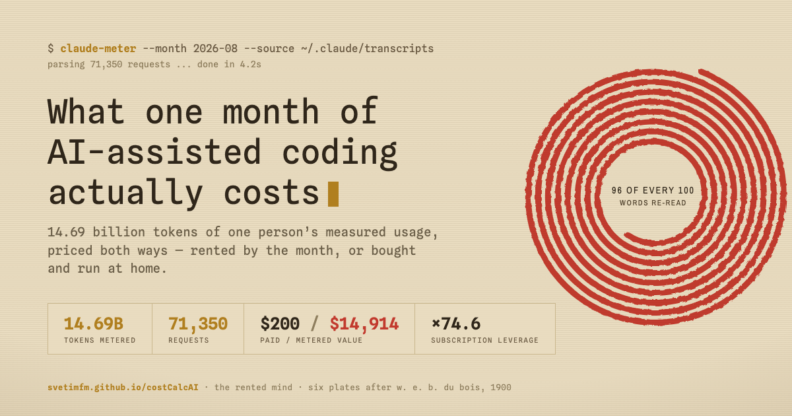
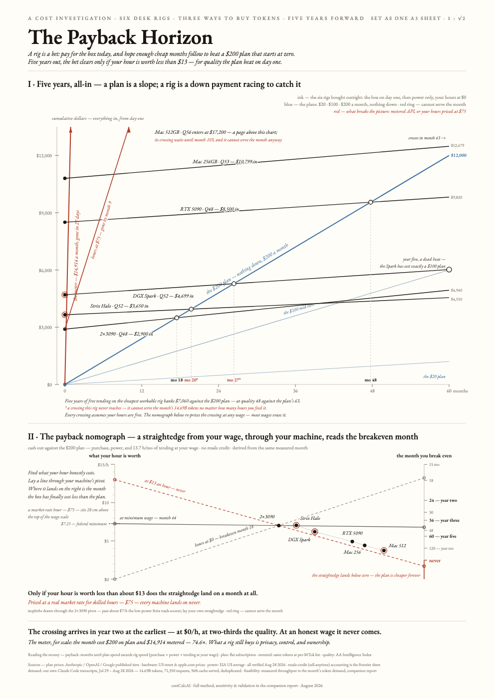

# costCalcAI — the true cost of local AI vs. cloud plans

One measured month of agentic coding with Claude Code (Jul 29 – Aug 28 2026:
**14.69B tokens, 71,350 requests, 96% cache-served**) would have cost
**$14,914 at API list price**. It cost **$200** on a subscription plan — a
**74.6× realized price compression**. This repo prices the same workload
against six desk rigs (2×3090, RTX 5090, Strix Halo, DGX Spark, Mac Studio
256/512GB) with honest TCO — hardware, power, capital, and labor — and
publishes the models, the source evidence, and every poster iteration.

**Live page:** [svetimfm.github.io/costCalcAI](https://svetimfm.github.io/costCalcAI/) —
*The Rented Mind*, the interactive report: six sections (the month, the
machines, the bill at a wage you choose, quality, the fair fight against hosted
open models, five years) plus a wall of hand-drawn plates after the data
portraits of W. E. B. Du Bois and the Atlanta University students, Paris
Exposition, 1900.

[](https://svetimfm.github.io/costCalcAI/)

## Headline findings

- **Feasibility first:** three of six rigs cannot serve the month's tokens at
  all — the heaviest workload needs 5.3 machine-months of compute per month.
- **Labor dominates TCO:** hardware amortization is $40–191/mo and power is
  $15–34/mo, but 13.7 h/mo of setup, patching, and tending at a market rate
  for skilled hours ($75/h — a model *parameter*, not anyone's paycheck; the
  nomograph exists so you can substitute your own number) adds $1,025/mo.
- **Payback horizon:** bought outright and tended for free, the cheapest rig
  breaks even against a $200 plan in month 18; the best-quality rig in month
  103. Price the tending above ≈$13/h and no rig ever breaks even.
- **Quality gap:** the best desk-servable model measures ~56 on the Artificial
  Analysis Intelligence Index vs 63 for the plans — a gap no desk closes.
- **Speed is not capability:** the only rigs that finish the month inside a
  month run a 27B-class model that is below the task; the page and the plates
  draw their hours hollow, for scale only. The best local model lives in the
  slowest box.
- **What local still buys:** privacy, control, and ownership — not cost.

## The posters (iterations v1 → v8)

| Version | File | Idea |
|---|---|---|
| v6 | `posters/infographic5.html` | "The Real Price of Local AI" — three-chart argument (amortization, market scatter, stress test) |
| v7 | `posters/infographic6.html` | "The Inference Frontier" — Pareto cost–capability frontier with an explicit dominance region |
| v8 | `posters/infographic7.html` | "The Payback Horizon" — five-year cumulative-cost race + a working straightedge **nomograph** (wage → rig pivot → breakeven month) |

Earlier layouts (v1–v5) and every full-page render pass are in `posters/` and
`renders/`. All posters are single self-contained HTML files, inline SVG,
990×1400 (A3 at 1:√2), print-ready via `@page{size:A3 portrait}`.



## Repo layout

- `index.html` — the live page, a self-contained single-file bundle (React,
  the Claude Design runtime, webfonts and the plates canvas all inline; it
  unpacks itself in the browser). Full page metadata — Open Graph, Twitter
  card, JSON-LD, canonical, manifest — lives in its head; a static summary
  sits under the loader for crawlers without JavaScript
- `assets/` — favicons (SVG, ICO, PNG, Apple touch icon, maskable),
  `og-banner.png` (1200×630 social preview), `site.webmanifest`
- `robots.txt`, `sitemap.xml`, `.nojekyll` — GitHub Pages plumbing
- `generators/` — Python generators, one per poster iteration
  (`build_infographic*.py`), the companion-report generator, and the
  patch scripts used between render passes
- `models/` — `cost_model.py` (prices Claude Code transcripts at published
  per-MTok rates, cache tiers included), `tco_model.py` + results, usage
  parser, intermediate datasets
- `source-data/` — primary evidence: llama.cpp GitHub discussions, kyuz0
  Strix Halo benchmark data, independent Mac/GPU benchmark writeups, EIA
  STEO Aug 2026, page snapshots
- `posters/` — final HTML per iteration (`*_shot.html` = screenshot variant
  with embedded fonts, `*_canvas.html` = slim webfont variant)
- `renders/` — full-page PNGs, including intermediate passes
- `report/` — the long-form companion report (method, sensitivity, validation)
- `fonts/` — EB Garamond, Fraunces, Caveat (SIL Open Font License) as woff2

## Reproduce

```sh
cd generators && python3 build_infographic7.py   # needs ../fonts/*.woff2 alongside (or copy them in)
"/Applications/Google Chrome.app/Contents/MacOS/Google Chrome" --headless \
  --disable-gpu --screenshot=out.png --window-size=990,1400 --hide-scrollbars \
  "file://$PWD/infographic7_shot.html"
```

`models/cost_model.py` re-prices your own last 30 days of Claude Code
transcripts (`~/.claude/projects`) at published per-MTok rates.

## Method notes

- **Cost constructs kept distinct:** cash TCO (36-mo amortization net of
  resale + 5%/yr capital + EIA power) · fully loaded (+ labor) · subscription
  price · metered API-equivalent.
- **Demand is measured, not modeled** — the author's own deduplicated
  transcripts, priced at list.
- **Labor rate is a dial, not a fact about any person.** Every headline is
  re-derivable at your own rate — that is what the v8 nomograph is for.
- Prices verified 2026-08-28 against provider-owned pages.
